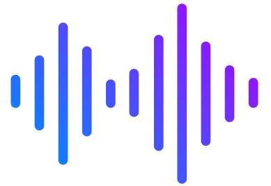

<h1 id="mainHeader" align="center">Youtube MP3 Converter</h1> 

<br>

<div align="center">
    
</div>

<br/>

## Table of Contents

- [Introduction](#introductionHeader)
- [Demo](#demoHeader)
- [Technologies](#technologiesHeader)
- [Features](#featuresHeader)
- [Prerequisites](#prerequisitesHeader)
- [Instructions](#instructionsHeader)
- [Contributors](#contributorsHeader)

<br/>

<h2 id="demoHeader">⚓ Demo</h2> 

https://github.com/ahmettoguz/Youtube_MP3_Converter/assets/101711642/d40b8506-f0a4-46f8-aeab-bdace80be8d9

<br/>

<h2 id="introductionHeader">📌 Introduction</h2> 

...

<br/>

<h2 id="technologiesHeader">☄️Technologies</h2> 

### DevOps

- [](https://www.docker.com/)

<br/>

### Web Server

- [](https://www.nginx.com/)
  
<br/>

### Backend Service

- [](nodejs.org)

- [](nodejs.orghttps://expressjs.com/)

- [](https://www.ibm.com/docs/bg/aix/7.2?topic=files-env-file)
  
- [](https://socket.io/)

<br/>

### Frontend Service

- 

- [](https://www.javascript.com/)
  
- [](https://vuejs.org/)

- [](https://jquery.com/)

- 
  
- [](https://getbootstrap.com/)

  
<br/>

<h2 id="featuresHeader">✨ Features</h2> 

* ...
  
* ...

<br/>

<h2 id="prerequisitesHeader">🔒 Prerequisites</h2> 

* ...
  
* ...

<br/>

<h2 id="instructionsHeader">📋 Instructions</h2> 

### Development Environment

#### Clone project

```bash
git clone https://github.com/ahmettoguz/Youtube_MP3_Converter
```

---

### Run backend service

```bash
cd ~/Youtube_MP3_Converter/backend

npm run start
```

---

#### Run frontend service

```bash
cd ~/Youtube_MP3_Converter/frontend

start frontend with npm run serve
```

<br/>

## Deployment Environment

#### Clone project

```bash
git clone https://github.com/ahmettoguz/Youtube_MP3_Converter
```

---

#### Frontend .env configuration

```bash
cd ~/Youtube_MP3_Converter/frontend

mv .env.txt .env

nano .env
```

---

#### Backend ssl configuration

```bash
cd ~/Youtube_MP3_Converter/backend/src/keys

bash placeKeys.sh
```

---

#### Nginx ssl

```bash
cd ~/Youtube_MP3_Converter/nginx/<domain-name>

nano <domain-name.conf>
```

```bash
cd ~/Youtube_MP3_Converter/nginx/<domain-name>/keys

bash placeKeys.sh
```

---

#### Run docker compose

```bash
cd ~/Youtube_MP3_Converter/

docker-compose up -d --build

docker ps -a

curl -I https://ahmetproje.com.tr
```

#### Stop docker compose

```bash
docker-compose down
```

<br/>

<h2 id="contributorsHeader">👥 Contributors</h2> 

<a href="https://github.com/ahmettoguz" target="_blank"></a>

[🔝](#mainHeader)
